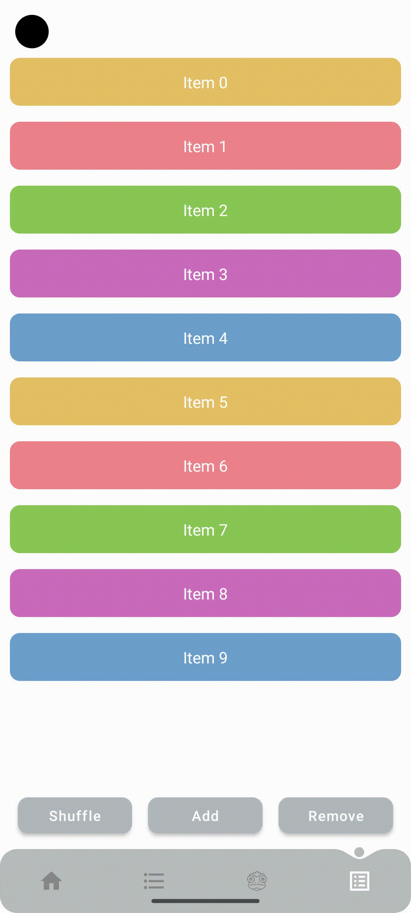

# Animations

## Links
* [LottieFiles](https://lottiefiles.com/)
* [Lottie Android Compose](https://github.com/airbnb/lottie/blob/master/android-compose.md)
* [Figma](https://www.figma.com/)
* [Aninix Plugin](https://www.aninix.com/)
* [Animated Navigation Bar](https://github.com/exyte/AndroidAnimatedNavigationBar)
* [Compose Animated List](https://github.com/SmartToolFactory/Compose-AnimatedList)
* [Exploring Jetpack Compose LazyList animations](https://fvilarino.medium.com/exploring-jetpack-compose-lazylist-animations-a3f97c91c2dd)
* [Create Jetpack Compose LazyList scroll effects](https://andreclassen1337.medium.com/create-android-compose-lazylist-scroll-effects-af5a423a53e6)
* [LazyColumn Animations in Jetpack Compose (with Examples)](https://semicolonspace.com/jetpack-compose-lazycolumn-animations/)
* [Animations in Jetpack Compose with examples](https://blog.canopas.com/animations-in-jetpack-compose-with-examples-48307ba9dff1)
* [How to create a Navigation Drawer with Jetpack Compose](https://johncodeos.com/how-to-create-a-navigation-drawer-with-jetpack-compose/)